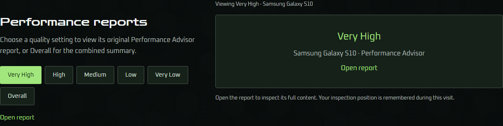
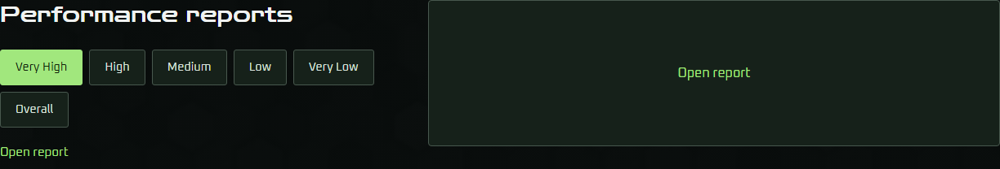
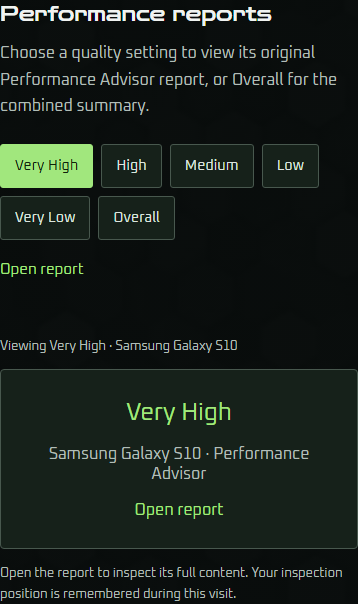
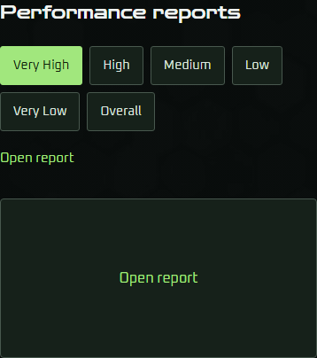

# Ticket #46: Regulus report presentation cleanup

Implemented [#46](https://github.com/komed-uth/Game-QA-Portfolio/issues/46) from synchronized main `75c691305d347f5691998e19b48907b497728bcb` on 2026-10-10. The owner's explicit implementation request supersedes the ticket's earlier implementation hold for this slice.

## Result

Report controls retain Performance reports, the six ordered quality choices, and Open report. The report preview retains only Open report as visible text. The introduction, visible Viewing status, inspection-position note, quality title, and device/tool line are removed. A nonvisual selection announcement and independently named report output and openers preserve selection context.

The preview frame retains its existing minimum height and padding. Obsolete status spacing and preview metadata styles are removed; the shared description and note styles remain for other portfolio sections. Desktop placement and the current narrow-screen controls-before-preview order remain intact. Original reports, modal content, gameplay showcases, Vecchio capture, project details, store links and visit-local inspection memory are unchanged.

## Visual evidence

These crops use the original main production build and the implemented production build, both initially selecting Very High. Desktop is 1366 × 768; phone is 390 × 845.

| View | Before | After |
| --- | --- | --- |
| Desktop |  |  |
| Phone |  |  |

The updated rendered report check fails against the original main build with `Introductory paragraph, visible Viewing status and inspection note are removed` (`3 !== 0`), and passes against the implemented build.

## Acceptance evidence

- Production/TypeScript build: passed.
- Preview-startup checks: passed.
- Browser-runner checks: 51 passed.
- Overlay-data checks: 5 passed; supplied real capture paths remain unavailable.
- Focused reports: passed, including all six choices, both openers, keyboard activation and visible focus, accessible output/openers, initial selection, per-report memory, reload reset, original tabs, chart interactions, dismissal and focus restoration.
- Focused photos after the timing correction: passed in 28.78 seconds.
- Responsive report checks: the existing ten viewports plus exactly 900px, preserving selection during resizing, control order, wrapping, 44px targets, collapsed spacing, existing preview size and no page overflow.
- Complete browser suite: passed all eight checks (slideshow, photos, gameplay previews, representative media lists, evidence modals, evidence interactions, synthetic report overlay, and report interactions). The final report check passed in 294.24 seconds; the complete run ended with `PASS: rendered portfolio browser checks`.

## Validation timing correction

The first complete run and isolated photo retry failed the existing `Open is blocked during transition` check. Its three separate browser reads can observe the opener after the 100ms outgoing and 150ms incoming fades finish. A browser probe confirmed opening blocked in the first frame but enabled after a controlled delayed read at 368.5ms. The original main build's photo check passed separately.

The photo check now captures selection, caption and opener state together in the first animation frame, retaining all original assertions and real CSS-animation checks. Gallery implementation and animation durations are unchanged.

## Review

Independent Sol 6.1 high-effort Standards and Spec reviews compare `git diff 75c691305d347f5691998e19b48907b497728bcb...HEAD` against repository guidance and #46/#43. Both the initial implementation and the timing correction have zero findings on either axis.

## Limits and risk

The synthetic report-overlay fixture verifies integration; the supplied original reports have empty screenshot path lists and cannot certify real capture overlays. Browser viewports do not certify physical devices. The change is reversible and affects report presentation/accessibility plus a browser-check timing correction; it introduces no migration or persistent state.
